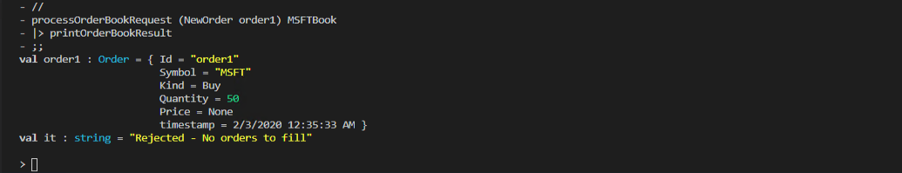
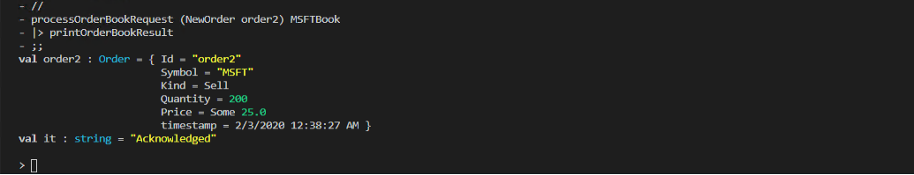
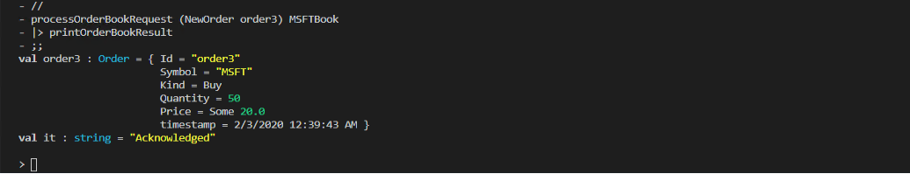
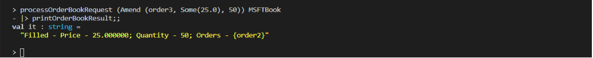
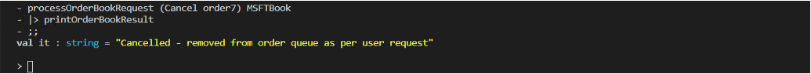

# FSharp-OrderMatchingEngine
Simulation of Stock exchange order-book matching mechanism in F#
 

The first **_buy market order_** get rejected as there are no sell orders in the orderbook.

then the first **_sell limit order_** gets queued in the orderbook (as its a **_limit_** order and there are no Buy orders to fill)

Next, **_buy limit order_** gets queued in the orderbook as there are no matching sell orders.

The above order gets filled when its price is **_amanded_** to match the top sell order in the orderbook

Orders can be removed from orderbook

